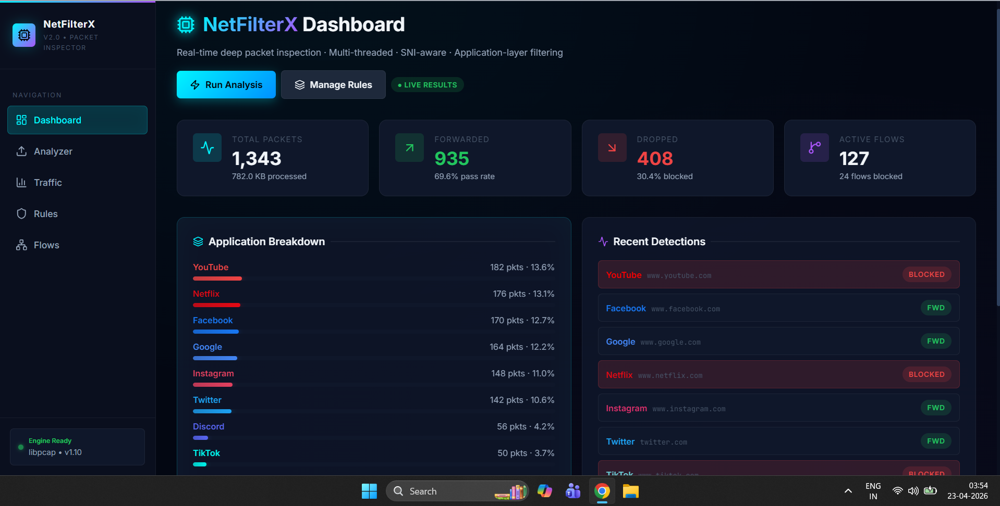
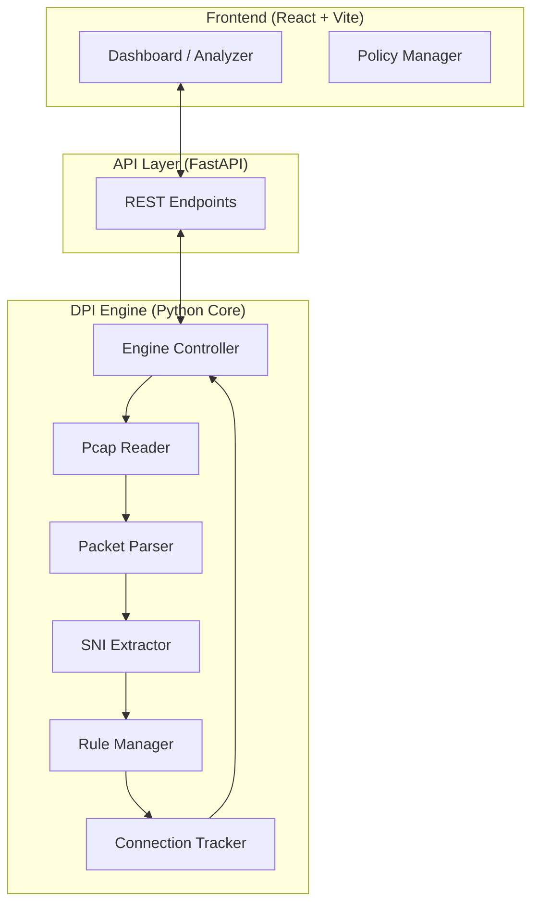

# NetFilterX
### Policy-Driven Deep Packet Inspection & Traffic Enforcement

NetFilterX is a professional-grade Deep Packet Inspection (DPI) system designed to analyze, classify, and enforce security policies on network traffic. By combining multi-threaded packet parsing with TLS SNI extraction, it provides real-time visibility and flow-level control over encrypted and plain-text communications.


*Professional dashboard showing real-time flow classification and blocking metrics.*

---

## 🚀 Key Features

- **Deep Packet Inspection**: Layer 7 application identification using SNI (Server Name Indication) and HTTP Host analysis.
- **Policy Enforcement**: Real-time blocking rules for specific IP addresses, domains, and application categories.
- **Traffic Analytics**: Detailed breakdowns of bandwidth usage, protocol distribution, and flow states.
- **High Performance**: Multi-threaded engine architecture capable of processing complex PCAP captures with zero packet loss.
- **Professional Reporting**: Export analysis results to clean, formatted PDF reports for security auditing.

---

## 🏗️ System Architecture

NetFilterX follows a modular architecture that separates the high-speed packet processing engine from the management UI.



---

## 📁 Project Structure

```bash
├── backend/            # FastAPI Server & PDF Generation
├── engine/             # Core DPI Logic (The "Brain")
│   ├── dpi_engine.py   # Main Orchestrator
│   ├── rule_manager.py # Policy Enforcement
│   └── types.py        # Shared Data Structures
├── frontend/           # React Dashboard & UI Components
│   ├── src/pages/      # Dashboard, Flows, Analyzer
│   └── src/components/ # Reusable UI Elements
└── docs/               # Documentation & Assets
```

---

## 🚀 Getting Started

### Prerequisites
- **Python 3.10+**
- **Node.js 18+**
- **Npcap** (Required for Windows packet capture)

### 1. Clone the Repository
```bash
git clone https://github.com/PradeepSomannavar/NetFilterX.git
cd NetFilterX
```

### 2. Setup Backend (Python)
```bash
cd backend
# Recommended: Use a virtual environment
python -m venv venv
.\venv\Scripts\activate  # On Linux/Mac: source venv/bin/activate

pip install -r requirements.txt
python main.py
```

### 3. Setup Frontend (React)
```bash
cd frontend
npm install
npm run dev
```

### 4. Run the Application
1. Ensure the backend is running at `http://localhost:3001`.
2. Open `http://localhost:5173` in your browser.
3. Start analyzing your network traffic!

---

## 📖 User Guide

### 1. Initial Analysis
1. Navigate to the **Analyzer** page.
2. Drag and drop your `.pcap` or `.pcapng` file into the upload zone.
3. Click **"Run Analysis"** to start the multi-threaded classification process.

### 2. Managing Security Policies
1. Go to the **Rules** page to define your security posture.
2. **Block Applications**: Toggle apps like YouTube or Netflix to automatically drop their traffic.
3. **Domain Filtering**: Add specific domains (e.g., `tiktok.com`) to enforce substring-based blocking.
4. **IP Blocking**: Enter specific source/destination IPs to blacklist entire hosts.

### 3. Inspecting Results
- **Dashboard**: Get a high-level overview of dropped vs. forwarded traffic.
- **Flows Page**: Search and sort through every individual connection detected.
- **Traffic Page**: View protocol distributions and bandwidth timelines.

---

## 🛠️ Detailed Setup (Windows)

NetFilterX requires low-level packet parsing capabilities. Follow these steps for a successful installation:

### 1. Dependencies
- **Npcap**: [Download and install Npcap](https://npcap.com/#download) in "WinPcap API-compatible mode".
- **Visual Studio Build Tools**: Install the "Desktop development with C++" workload via the [Visual Studio Installer](https://visualstudio.microsoft.com/downloads/).

### 2. Environment Configuration
Create a `.env` file in the `backend/` directory if you need to override default ports or upload limits:
```env
PORT=3001
UPLOAD_LIMIT=50MB
```

---

## 💻 Tech Stack

- **Backend**: Python, FastAPI, Scapy (Packet Parsing)
- **Frontend**: React 18, Vite, Tailwind CSS, Recharts
- **Icons**: Lucide React
- **Design**: Premium Dark Mode with Glassmorphism effects

---
*Developed for advanced network security analysis and policy-driven traffic management.*

